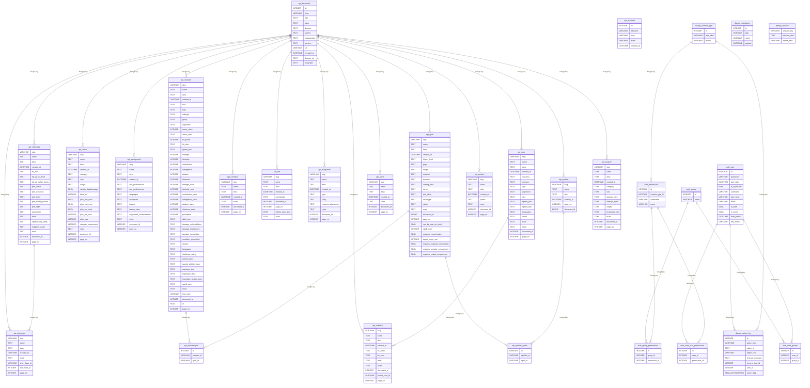

```mermaid
erDiagram

  api_document {
    INTEGER id
    VARCHAR slug
    TEXT title
    TEXT desc
    TEXT license
    TEXT author
    TEXT organization
    TEXT version
    VARCHAR url
    DATETIME created_at
    TEXT license_url
    TEXT copyright
  }

  api_manifest {
    INTEGER id
    VARCHAR filename
    VARCHAR type
    VARCHAR hash
    DATETIME created_at
  }

  auth_group {
    INTEGER id
    VARCHAR name
  }

  auth_user {
    INTEGER id
    VARCHAR password
    DATETIME last_login
    BOOL is_superuser
    VARCHAR username
    VARCHAR last_name
    VARCHAR email
    BOOL is_staff
    BOOL is_active
    DATETIME date_joined
    VARCHAR first_name
  }

  django_content_type {
    INTEGER id
    VARCHAR app_label
    VARCHAR model
  }

  django_migrations {
    INTEGER id
    VARCHAR app
    VARCHAR name
    DATETIME applied
  }

  django_session {
    VARCHAR session_key
    TEXT session_data
    DATETIME expire_date
  }

  api_armor {
    VARCHAR slug
    TEXT name
    TEXT desc
    DATETIME created_at
    TEXT category
    TEXT cost
    TEXT weight
    BOOL stealth_disadvantage
    INTEGER base_ac
    BOOL plus_dex_mod
    BOOL plus_con_mod
    BOOL plus_wis_mod
    INTEGER plus_flat_mod
    INTEGER plus_max
    INTEGER strength_requirement
    TEXT route
    INTEGER document_id
    INTEGER page_no
  }

  api_background {
    VARCHAR slug
    TEXT name
    TEXT desc
    DATETIME created_at
    TEXT skill_proficiencies
    TEXT tool_proficiencies
    TEXT languages
    TEXT equipment
    TEXT feature
    TEXT feature_desc
    TEXT suggested_characteristics
    TEXT route
    INTEGER document_id
    INTEGER page_no
  }

  api_charclass {
    VARCHAR slug
    TEXT name
    TEXT desc
    DATETIME created_at
    TEXT hit_dice
    TEXT hp_at_1st_level
    TEXT hp_at_higher_levels
    TEXT prof_armor
    TEXT prof_weapons
    TEXT prof_tools
    TEXT prof_saving_throws
    TEXT prof_skills
    TEXT equipment
    TEXT table
    TEXT spellcasting_ability
    TEXT subtypes_name
    TEXT route
    INTEGER document_id
    INTEGER page_no
  }

  api_condition {
    VARCHAR slug
    TEXT name
    TEXT desc
    DATETIME created_at
    TEXT route
    INTEGER document_id
    INTEGER page_no
  }

  api_feat {
    VARCHAR slug
    TEXT name
    TEXT desc
    DATETIME created_at
    TEXT prerequisite
    INTEGER document_id
    INTEGER page_no
    TEXT effects_desc_json
    TEXT route
  }

  api_magicitem {
    VARCHAR slug
    TEXT name
    TEXT desc
    DATETIME created_at
    TEXT type
    TEXT rarity
    TEXT requires_attunement
    TEXT route
    INTEGER document_id
    INTEGER page_no
  }

  api_monster {
    VARCHAR slug
    TEXT name
    TEXT desc
    DATETIME created_at
    TEXT size
    TEXT type
    TEXT subtype
    TEXT group
    TEXT alignment
    INTEGER armor_class
    TEXT armor_desc
    INTEGER hit_points
    TEXT hit_dice
    TEXT speed_json
    INTEGER strength
    INTEGER dexterity
    INTEGER constitution
    INTEGER intelligence
    INTEGER wisdom
    INTEGER charisma
    INTEGER strength_save
    INTEGER dexterity_save
    INTEGER constitution_save
    INTEGER intelligence_save
    INTEGER wisdom_save
    INTEGER charisma_save
    INTEGER perception
    TEXT skills_json
    TEXT damage_vulnerabilities
    TEXT damage_resistances
    TEXT damage_immunities
    TEXT condition_immunities
    TEXT senses
    TEXT languages
    TEXT challenge_rating
    TEXT actions_json
    TEXT special_abilities_json
    TEXT reactions_json
    TEXT legendary_desc
    TEXT legendary_actions_json
    TEXT spells_json
    TEXT route
    VARCHAR img_main
    INTEGER document_id
    REAL cr
    INTEGER page_no
  }

  api_plane {
    VARCHAR slug
    TEXT name
    TEXT desc
    DATETIME created_at
    TEXT route
    INTEGER document_id
    INTEGER page_no
  }

  api_race {
    VARCHAR slug
    TEXT name
    TEXT desc
    DATETIME created_at
    TEXT asi_desc
    TEXT asi_json
    TEXT age
    TEXT alignment
    TEXT size
    TEXT speed_json
    TEXT speed_desc
    TEXT languages
    TEXT vision
    TEXT traits
    TEXT route
    INTEGER document_id
    INTEGER page_no
  }

  api_section {
    VARCHAR slug
    TEXT name
    TEXT desc
    DATETIME created_at
    TEXT parent
    TEXT route
    INTEGER document_id
    INTEGER page_no
  }

  api_spell {
    VARCHAR slug
    TEXT name
    TEXT desc
    DATETIME created_at
    TEXT higher_level
    TEXT page
    TEXT range
    TEXT material
    TEXT duration
    TEXT casting_time
    TEXT school
    TEXT dnd_class
    TEXT archetype
    TEXT circles
    TEXT route
    BIGINT document_id
    INTEGER page_no
    BOOL can_be_cast_as_ritual
    INTEGER spell_level
    BOOL requires_concentration
    INTEGER target_range_sort
    BOOL requires_material_components
    BOOL requires_somatic_components
    BOOL requires_verbal_components
  }

  api_spelllist {
    VARCHAR slug
    TEXT name
    TEXT desc
    DATETIME created_at
    INTEGER page_no
    BIGINT document_id
  }

  api_weapon {
    VARCHAR slug
    TEXT name
    TEXT desc
    DATETIME created_at
    TEXT category
    TEXT cost
    TEXT damage_dice
    TEXT damage_type
    TEXT weight
    TEXT properties_json
    TEXT route
    INTEGER document_id
    INTEGER page_no
  }

  auth_permission {
    INTEGER id
    INTEGER content_type_id
    VARCHAR codename
    VARCHAR name
  }

  auth_user_groups {
    INTEGER id
    INTEGER user_id
    INTEGER group_id
  }

  django_admin_log {
    INTEGER id
    DATETIME action_time
    TEXT object_id
    VARCHAR object_repr
    TEXT change_message
    INTEGER content_type_id
    INTEGER user_id
    SMALLINTUNSIGNED action_flag
  }

  api_archetype {
    VARCHAR slug
    TEXT name
    TEXT desc
    DATETIME created_at
    TEXT route
    VARCHAR char_class_id
    INTEGER document_id
    INTEGER page_no
  }

  api_monsterspell {
    INTEGER id
    VARCHAR monster_id
    VARCHAR spell_id
  }

  api_spelllist_spells {
    INTEGER id
    VARCHAR spelllist_id
    VARCHAR spell_id
  }

  api_subrace {
    VARCHAR slug
    TEXT name
    TEXT desc
    DATETIME created_at
    TEXT asi_desc
    TEXT asi_json
    TEXT traits
    TEXT route
    INTEGER document_id
    VARCHAR parent_race_id
    INTEGER page_no
  }

  auth_group_permissions {
    INTEGER id
    INTEGER group_id
    INTEGER permission_id
  }

  auth_user_user_permissions {
    INTEGER id
    INTEGER user_id
    INTEGER permission_id
  }

  api_document ||--o{ api_archetype : "foreign key"
  api_document ||--o{ api_armor : "foreign key"
  api_document ||--o{ api_background : "foreign key"
  api_document ||--o{ api_charclass : "foreign key"
  api_document ||--o{ api_condition : "foreign key"
  api_document ||--o{ api_feat : "foreign key"
  api_document ||--o{ api_magicitem : "foreign key"
  api_document ||--o{ api_monster : "foreign key"
  api_document ||--o{ api_plane : "foreign key"
  api_document ||--o{ api_race : "foreign key"
  api_document ||--o{ api_section : "foreign key"
  api_document ||--o{ api_spell : "foreign key"
  api_document ||--o{ api_spelllist : "foreign key"
  api_document ||--o{ api_subrace : "foreign key"
  api_document ||--o{ api_weapon : "foreign key"
  auth_group ||--o{ auth_group_permissions : "foreign key"
  auth_group ||--o{ auth_user_groups : "foreign key"
  auth_user ||--o{ auth_user_groups : "foreign key"
  auth_user ||--o{ auth_user_user_permissions : "foreign key"
  auth_user ||--o{ django_admin_log : "foreign key"
  django_content_type ||--o{ auth_permission : "foreign key"
  django_content_type ||--o{ django_admin_log : "foreign key"
  api_charclass ||--o{ api_archetype : "foreign key"
  api_monster ||--o{ api_monsterspell : "foreign key"
  api_race ||--o{ api_subrace : "foreign key"
  api_spell ||--o{ api_monsterspell : "foreign key"
  api_spell ||--o{ api_spelllist_spells : "foreign key"
  api_spelllist ||--o{ api_spelllist_spells : "foreign key"
  auth_permission ||--o{ auth_group_permissions : "foreign key"
  auth_permission ||--o{ auth_user_user_permissions : "foreign key"
```