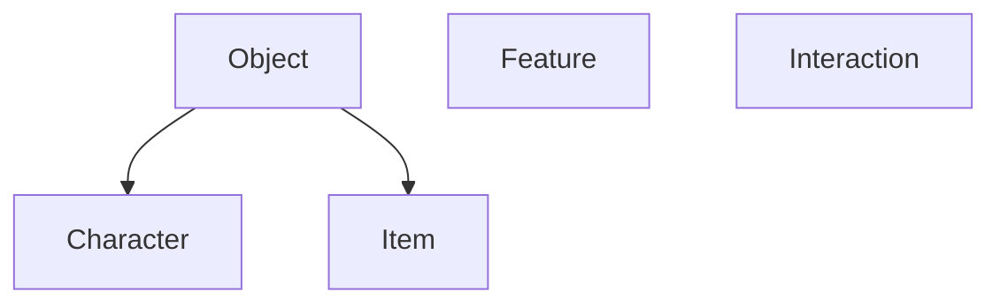

# Model Design

## Base Models
Our base open5e models are GameContent (an abstract), and Document, which is a description of the source document that the GameContent items come from. These more or less stay the same as they are in API V1.

Our base GameContent models are Object, which describes all matter, Feature, which describes modifications to the base Object, and Interaction, which is a description of how an object can interact with other objects.


Here is an example simple feature, in rough JSON representation.

```
"name": "Reckless Attack",
"desc_md": "Starting at 2nd level, you can throw aside all concern for defense to attack with fierce desperation. When you make your first attack on your turn, you can decide to attack recklessly. Doing so gives you advantage on melee weapon attack rolls using Strength during this turn, but attack rolls against you have advantage until your next turn."
```

**Features** will have name and description. They may have some reference to modify fields of the parent object, for example:
"gain":["name":"armor-proficiency","value":"heavy armor"]. I don't have a great model for this.

**Objects** will have AC, HP, size, weight, damage immunities, resistances, and vulnerabilities, and maybe a few other fields.

**Characters** will have stat blocks, saving throws, skills, speed, etc.

**Items** will have rarity, cost, "requires attunement" and various other fields.

**Interaction** is a description of the player interacting with the world. "Use" is an interaction. "Melee Weapon Attack with Longsword" is an interaction.

## Sets
Some of the leaf nodes has a Set model as well. These are implemented as a GameContent item, but it's basically just a list of other objects with a small amount of added metadata. For example, Character Class and Subclass would be implemented as a FeatureSet. Additionally Race, Subrace, and Feats would be implemented as a FeatureSet.

```mermaid
graph TD;
    Character1-->CharacterSet;
    Character2-->CharacterSet;
    Character3-->CharacterSet;
    Item1-->ItemSet;
    Item2-->ItemSet;
    Item3-->ItemSet;
    Feature1--FeatureSet;
    Feature2--FeatureSet;
    Feature3--FeatureSet;
    Interaction1--InteractionSet;
    Interaction2--InteractionSet;
    Interaction3--InteractionSet;
```

Here is an example featureSet, in rough JSON representation.

```
"name": "Barbarian",
"desc_md": "",
"featureset_type": "Class",
"features": [
    "rage",
    "unarmored-defense",
    "reckless-attack"
]
```

## Benefits of this approach:
The API V2 could have a /v2/classes/ endpoint that returns featureset with a hard filter of featureset_type=Class.

The exact same implementation could be used for the Feats endpoint. Very quick, reusable coding, and simple to troubleshoot. The concept of FeatureSet doesn't even need to be exposed to the UI.

Similarly, CharacterSet could be used for a /NPCs/ endpoint, or a /Monsters/Coastal/ endpoint.

Additionally, /v2/spells endpoint could return interactionSets that are interactionSet_type=spell

Things like Poisons, Equipment Packs, and Magic Weapons become queryable quickly as long as they are "tagged" in a properly named ItemSet.

## Cons of this approach:
Lots more API calls: This will result in a request for EACH feature in a given FeatureSet. I think this works though, modern browsers and caching are fast, and each individual request will be small, and can be done in parallel.

## Unanswered questions:
Features often modify fields of a related Object. How is this modification of fields specified?

A spell can be cast at a bunch of different levels. Is each casting option a different interaction? What about cantrips? How can the different damage rolls be represented?

What does the data importing model look like? It will almost certainly deviate pretty significantly from what we've done already.